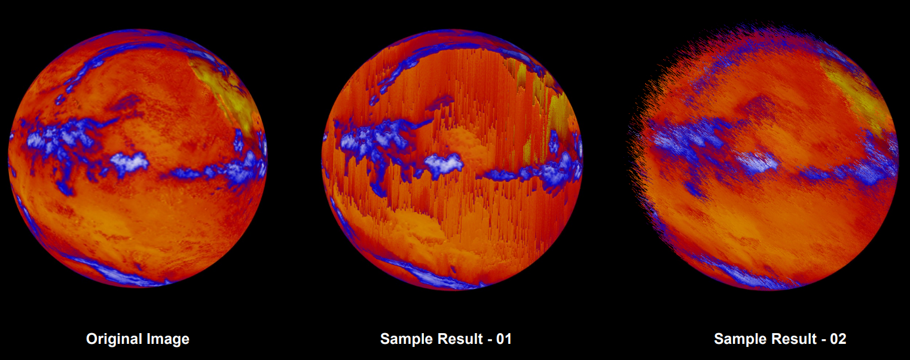

# Automated Pixel Sorting

## Aim :

- To randomly generate pixel-sorted results from image files.
- To be able to randomize it as much as possible and to do everything from the terminal.

## Purpose :

The purpose of the script is to generate custom number of pixel-sorted images from input file.

## Short description of package/script :

- Pixel sorting images using the [Pixelsort](https://github.com/satyarth/pixelsort) library.
- Running the code randomly generates 'N' number of images.
- Everything, from count and choice of paramters to the values they hold, is randomly generated.
- The results are stored in a seperate folder which is emptied on each fresh run.

## Workflow of the Project :

- When the script is run, it expects few parameters to be passed : number of expected results ```-n``` and input file ```-i```
- Once the number of results and filename is defined, the script deletes any existing file in the "generated" folder.
- Then a loop is run 'N' times where 'N' is the count that is passed to the script from the terminal.
- In each run of the loop, the count and choice of paramters are decided and the same is printed out.
- These randomized parameters are then used to call the ```perform_sorting()``` function which does the sorting on the image.
- Each run of the function generates a new image file which is then saved to the "generated" folder with a different name.

## Setup instructions :

- Install required libraries : ```pip install -r requirements.txt```
- Place your file in the "images" folder for the script to work on it. [jpg/png/etc.]
- Run and pass parameters : ```python automated_pixel_sorting.py -i image.jpg -n 5```
- You can view the results from the "generated" folder and run the script again to get new randomized results.

## Output :



## Author(s) :

- [Tanya Sabarwal](https://github.com/Tanya-18)
